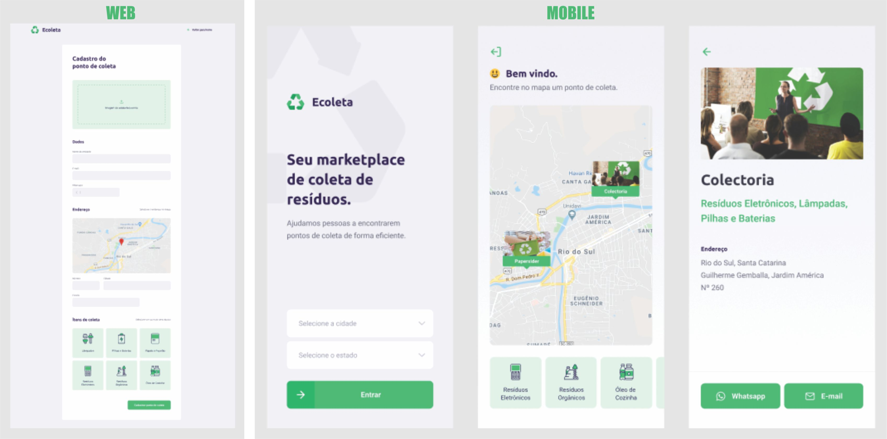

<h1 align="center">
    Ecoleta
</h1>

 

  

## Tecnologias
Esse projeto foi desenvolvido com as seguintes tecnologias:

- [Node.js](https://nodejs.org/en/ "Node.js")
- [React](https://reactjs.org/ "React")
- [React Native](https://facebook.github.io/react-native/ "React Native")
- [Expo](https://expo.io/ "Expo")

## Projeto

Código desenvolvido durante o Next Level Week #01 da [Rocketseat](https://rocketseat.com.br "Rocketseat"). O Ecoleta é um marketplace que ajuda pessoas a encontrarem pontos de coleta de resíduos de forma eficiente.

## Layout

  

---